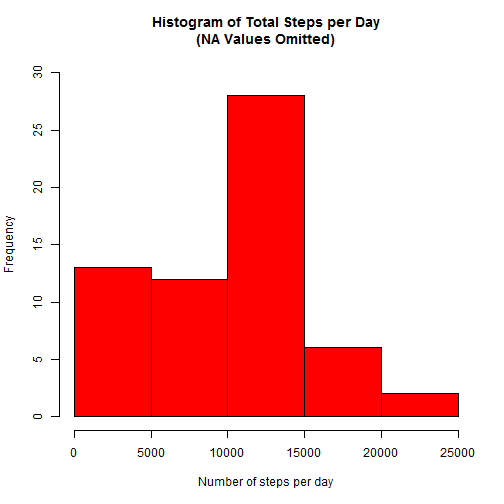
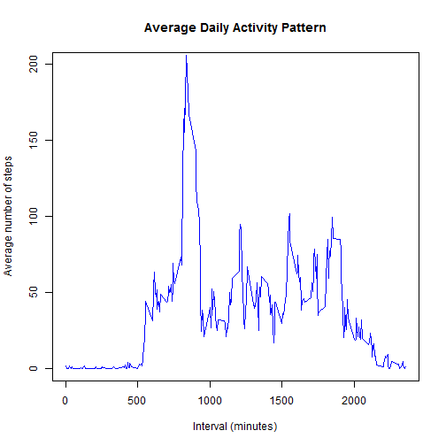
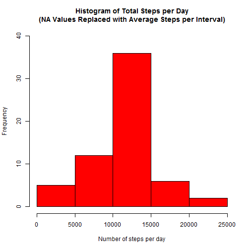

## Introduction

It is now possible to collect a large amount of data about personal
movement using activity monitoring devices such as a
[Fitbit](http://www.fitbit.com), [Nike
Fuelband](http://www.nike.com/us/en_us/c/nikeplus-fuelband), or
[Jawbone Up](https://jawbone.com/up). These type of devices are part of
the "quantified self" movement -- a group of enthusiasts who take
measurements about themselves regularly to improve their health, to
find patterns in their behavior, or because they are tech geeks. But
these data remain under-utilized both because the raw data are hard to
obtain and there is a lack of statistical methods and software for
processing and interpreting the data.

This assignment makes use of data from a personal activity monitoring
device. This device collects data at 5 minute intervals through out the
day. The data consists of two months of data from an anonymous
individual collected during the months of October and November, 2012
and include the number of steps taken in 5 minute intervals each day.

## Data

The data for this assignment can be downloaded from the course web
site:

* Dataset: [Activity monitoring data](https://d396qusza40orc.cloudfront.net/repdata%2Fdata%2Factivity.zip) [52K]

The variables included in this dataset are:

* **steps**: Number of steps taking in a 5-minute interval (missing
    values are coded as `NA`)

* **date**: The date on which the measurement was taken in YYYY-MM-DD
    format

* **interval**: Identifier for the 5-minute interval in which
    measurement was taken

The dataset is stored in a comma-separated-value (CSV) file and there
are a total of 17,568 observations in this
dataset.

## Loading and preprocessing the data

The assumption is made that the activity dataset has been downloaded and placed in the current working directory.

1. Load the data (i.e. `read.csv()`)


```r
# Check that data file is present and ensure that it is unzipped.

if (!file.exists("activity.csv")) {
        unzip("activity.zip")
}

# Read in the raw activity data.
activityData <- read.csv("activity.csv")
```

2. Process/transform the data (if necessary) into a format suitable for your analysis


```r
# Load the lattice graphical library for use in answering question #4.
library(lattice)

# Convert the date variable to date class.

activityData$date <- as.Date(activityData$date, format="%Y-%m-%d")
```

## What is mean total number of steps taken per day?

For this part of the assignment, you can ignore the missing values in
the dataset.

1. Make a histogram of the total number of steps taken each day


```r
# Calculate the total number of steps taken each day.
stepsPerDay <- tapply(activityData$steps, activityData$date, sum, na.rm=TRUE)

# Generate the histogram.
hist(stepsPerDay,
     main="Histogram of Total Steps per Day\n(NA Values Omitted)",
     xlab="Number of steps per day",
     col="red",
     ylim=c(0,30))
```

 

2. Calculate and report the **mean** and **median** total number of steps taken per day


```r
#Calculate the mean.
stepsMean <- mean(stepsPerDay)

#Calculate the median.
stepsMedian <- median(stepsPerDay)
```

The mean number of steps per day is **9354** and the median number of steps per day is **10395**.

## What is the average daily activity pattern?

1. Make a time series plot (i.e. `type = "l"`) of the 5-minute interval (x-axis) and the average number of steps taken, averaged across all days (y-axis)


```r
# Calculate the mean number of steps taken across all days for each interval.
timeSeries <- tapply(activityData$steps, activityData$interval, mean,
                      na.rm=TRUE)

# Generate the time series plot.
plot(row.names(timeSeries),
     timeSeries,
     type="l",
     main="Average Daily Activity Pattern",
     xlab="Interval (minutes)",
     ylab="Average number of steps",
     col="blue",
     ylim=c(0,200))
```

 

2. Which 5-minute interval, on average across all the days in the dataset, contains the maximum number of steps?


```r
# Identify the interval containing the maximum number of steps.
maxInterval <- timeSeries[which.max(timeSeries)]
```

The 5-minute interval containing the maximum number of steps is **835**.

## Imputing missing values

Note that there are a number of days/intervals where there are missing
values (coded as `NA`). The presence of missing days may introduce
bias into some calculations or summaries of the data.

1. Calculate and report the total number of missing values in the dataset (i.e. the total number of rows with `NA`s)


```r
# Calculate the total number of missing values in the dataset.
totalNA <- sum(is.na(activityData))
```

The total number of missing values in the dataset is **2304**.

2. Devise a strategy for filling in all of the missing values in the dataset. The strategy does not need to be sophisticated. For example, you could use the mean/median for that day, or the mean for that 5-minute interval, etc.

The strategy that will be used for filling in the missing values in the dataset is to replace NA values with the mean for the 5-minute interval.


```r
# Create a dataframe containing the mean number of steps taken across all days for each interval.
averageSteps <- aggregate(activityData$steps, by=list(activityData$interval),
                                                      FUN=mean, na.rm=TRUE)

#Rename columns to match those used in ActivityData
names(averageSteps) <- c("interval", "steps")

# Create an empty vector to hold imputed values.                           
imputeNA <- integer()

# Identify and replace NA values with the mean number of steps for the 5-minute interval 
# and populate vector with imputed values.
for (i in 1:nrow(activityData)) {
        obs <- activityData[i, ]
        if (is.na(obs$steps)) {
                steps <- subset(averageSteps, interval == obs$interval)$steps
        } else {
                steps <- obs$steps
        }
        imputeNA <- c(imputeNA, steps)
}
```

3. Create a new dataset that is equal to the original dataset but with the missing data filled in.


```r
# Create new data set containing original data.
newActivityData <- activityData

# Replace steps data with imputed values.
newActivityData$steps <- imputeNA
```

View the first few rows of the new dataset to confirm imputed values are present.


```r
head(newActivityData)
```

```
##       steps       date interval
## 1 1.7169811 2012-10-01        0
## 2 0.3396226 2012-10-01        5
## 3 0.1320755 2012-10-01       10
## 4 0.1509434 2012-10-01       15
## 5 0.0754717 2012-10-01       20
## 6 2.0943396 2012-10-01       25
```

4. Make a histogram of the total number of steps taken each day and Calculate and report the **mean** and **median** total number of steps taken per day. Do these values differ from the estimates from the first part of the assignment? What is the impact of imputing missing data on the estimates of the total daily number of steps?


```r
# Calculate the new total number of steps taken each day.
newStepsPerDay <- tapply(newActivityData$steps, newActivityData$date, sum, na.rm=TRUE)

# Generate the histogram.
hist(newStepsPerDay,
     main="Histogram of Total Steps per Day\n(NA Values Replaced with Average Steps per Interval)",
     xlab="Number of steps per day",
     col="red",
     ylim=c(0,40))
```

 

Calculate the mean and median using the new dataset.


```r
#Calculate the new mean.
newStepsMean <- mean(newStepsPerDay)

#Calculate the median.
newStepsMedian <- median(newStepsPerDay)
```

The mean number of steps per day is **10766** and the median number of steps per day is **10766**.

These values are highter than the estimates from the first part of the assignment. This is to be expected, since there are no longer any days in the dataset with zero steps. However, the overall trend in the data remains more or less the same.

## Are there differences in activity patterns between weekdays and weekends?

For this part the `weekdays()` function may be of some help here. Use
the dataset with the filled-in missing values for this part.

1. Create a new factor variable in the dataset with two levels -- "weekday" and "weekend" indicating whether a given date is a weekday or weekend day.


```r
# Determine the day name for each date.
day <- weekdays(newActivityData$date)

# Create an empty vector to hold the type of day.
dayType <- factor(levels=c("weekday","weekend"))

# Poplulate vector with type of day (weekday or weekend) for each date.
for (i in 1:nrow(newActivityData)) {
        if (day[i] == "Saturday") {
                dayType[i] <- "weekend"
        } else if (day[i] == "Sunday") {
                dayType[i] <- "weekend"
        } else {
                dayType[i] <- "weekday" 
        }
}

# Add dayType variable to the dataset
newActivityData$dayType <- dayType
```
View the first few rows of the modified dataset to confirm that the new variable is present.


```r
head(newActivityData)
```

```
##       steps       date interval dayType
## 1 1.7169811 2012-10-01        0 weekday
## 2 0.3396226 2012-10-01        5 weekday
## 3 0.1320755 2012-10-01       10 weekday
## 4 0.1509434 2012-10-01       15 weekday
## 5 0.0754717 2012-10-01       20 weekday
## 6 2.0943396 2012-10-01       25 weekday
```

2. Make a panel plot containing a time series plot (i.e. `type = "l"`) of the 5-minute interval (x-axis) and the average number of steps taken, averaged across all weekday days or weekend days (y-axis). 


```r
# Create a dataframe containing the mean number of steps per interval taken across all weekend or weekday days.
meanAverageSteps <- aggregate(newActivityData$steps,
                          by=list(newActivityData$interval,
                                  newActivityData$dayType),                                                      FUN=mean)

#Rename columns 
names(meanAverageSteps) <- c("interval", "dayType", "meanSteps")

# Generate the panel plot
xyplot(meanSteps ~ interval | dayType, 
       meanAverageSteps, 
       type="l", 
       layout=c(1,2),
       xlab = "Interval",
       ylab = "Number of steps")
```

 
